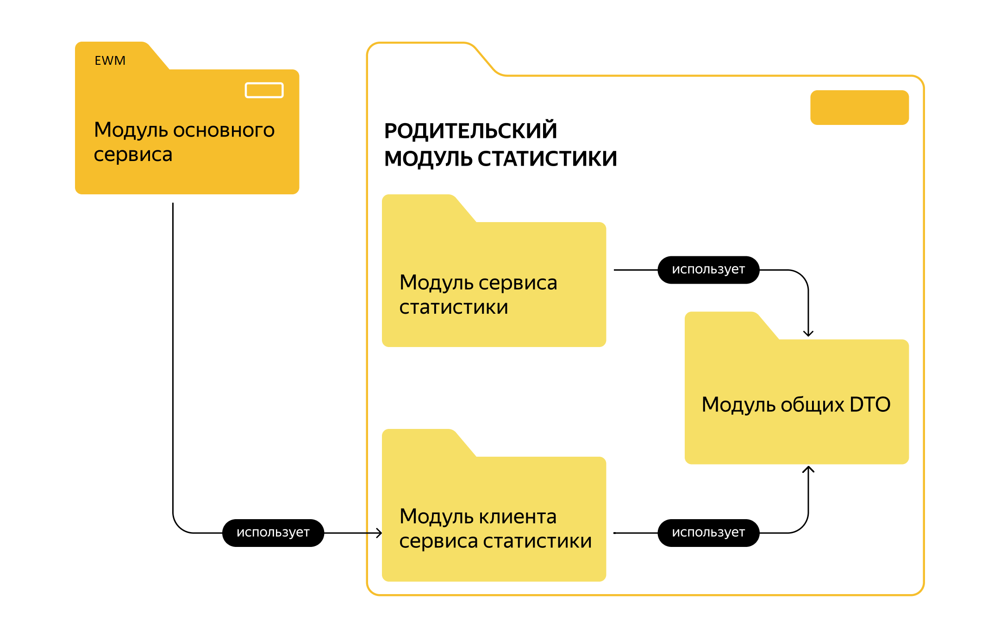

# java-explore-with-me

## Описание сервисов

### 1. Основной сервис
Представляет собой основной функционал приложения. В нем можно предложить какое-либо событие от выставки до похода в кино и собрать компанию для участия в нём.

### 2. Сервис Статистики
Сервис статистики будет собирать информацию. Во-первых, о количестве обращений пользователей к спискам событий и, во-вторых, о количестве запросов к подробной информации о событии. На основе этой информации должна формироваться статистика о работе приложения.
## Структура модулей и зависимостей:

## Локальный запуск сервисов:
#### В корневой директории выполнить команду docker-compose up.
